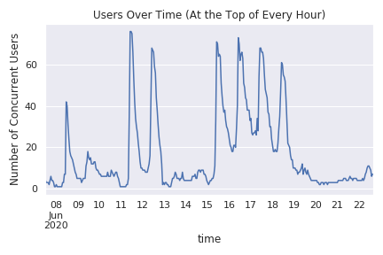
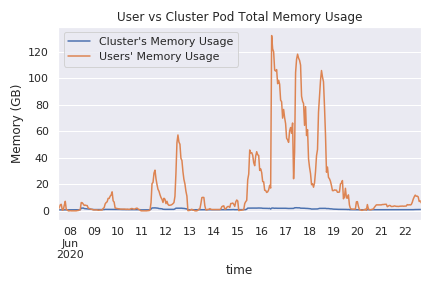

# Notes on JupyterHub infrastructure for the IceSat-2 2020 Hackweek

Relevant links:
- [JupyterHub Configuration](https://github.com/ICESAT-2HackWeek/jupyterhub-2020)
- [Infrastructure Configuration](https://github.com/ICESAT-2HackWeek/terraform-deploy/tree/master)
- [Computational Environment](https://github.com/ICESAT-2HackWeek/jupyter-image-2020 )

### Versions:
- Terraform version: [12.6](https://github.com/ICESAT-2HackWeek/terraform-deploy/blob/master/aws/main.tf#L2)
- Helm Version: 3. Minor version is not recalled or recorded.
- JupyterHub Helm chart version: [v0.9.0-beta.3.n030.h796379e](https://github.com/ICESAT-2HackWeek/jupyterhub-2020/blob/staging/hub/requirements.yaml)
- Prometheus Helm chart version: [11.2.1](https://github.com/ICESAT-2HackWeek/terraform-deploy/blob/master/aws/monitoring.tf#L25)
- Grafana Helm chart version: [5.0.24](https://github.com/ICESAT-2HackWeek/terraform-deploy/blob/master/aws/monitoring.tf#L44)
- Cluster-autoscaler Helm chart version: [unspecified](https://github.com/ICESAT-2HackWeek/terraform-deploy/blob/master/aws/autoscaler.tf#L68)
- EFS-Provisioner Helm chart version: [0.11.0](https://github.com/ICESAT-2HackWeek/terraform-deploy/blob/master/aws/efs.tf#L53)
- AWS Node Termination Helm chart version: [unspecified](https://github.com/ICESAT-2HackWeek/terraform-deploy/blob/master/aws/aws-node-termination-handler.tf#L10)

Resource requests per-user:
```
    cpu:
      limit: 4
      guarantee: 1.75
    memory:
      limit: 8G
      guarantee: 7G
```

Note m5 and m4 2xlarge nodes, so 4 people per node. 100Gb local disk
+ EFS drive with default settings. CPUs are logical cores, so the
limit of 4 is 2 physical cpu cores with each with 2 independent
threads.

### Successes
- Generally very stable for 80 simultaneous users! 
- Scale-up time less then 5 minutes per person

### Issues
- Scale down an issue when people do not explicitly log out. Common
to wake up to 5-10 nodes running for over 12 hours. 
- Some complaints regarding performance when tutorials read the same
data on `/srv/shared` network storage location
- The `aws-node-termination-handler` will correctly replace user
nodes if the nodes need replacing but users will not know why this is
happening nor be able to do anything about it.

### Lessons Learned / Future Hackweeks

- Having prometheus / grafana is great to understand how CPU, RAM,
network activity changes over time, and can be used to diagnose
performance issues for individual users or nodes. Could be helpful to
make these visualizations public and come up with custom dashboards 
like instantaneous CPU % versus default averages over 10 minutes)
  - Grafana probably needs a separate login per person who wants to
  login simultaneously
  - More practice with Grafana and more tailored dashboarding will
  help admins to utilize Grafana usefully. I’ve spent a lot of time
  just wondering how to do things in Grafana.
  - I found a dashboard that was simple and good to work with:
  [ID 10000](https://grafana.com/grafana/dashboards/10000).
  Configuration to use this is present in
  https://github.com/ICESAT-2HackWeek/terraform-deploy/blob/master/aws/grafana-values-min.yaml
  - Grafana data was extracted for use with pandas and yielded
  plots of JupyterHub usage. Some can be seen below.
- Multi-user load testing would be nice.
  - logins https://github.com/yuvipanda/hubtraf not being updated :( 
  - Would be nice to test that the cluster can autoscale correctly
  with many users logging in prior to the event.
  - run tutorial content with multiple users simultaneously *instead*
  of just tutorial lead. Then you understand typical multi-user
  performance instead of single user performance.
  - Not sure of other options.
- Could consider a “high performance hackweek” option, where each
person gets their own dedicated node (e.g. 8 cores, 32 Gb ram, 100Gb
scratch drive, GPU? ) and the shared drive is AWS FSX Lustre instead
of EFS).
  - The vast majority of costs for the hackweeks are from compute
  instances: IceSat-2's hackweek had these costs as ~90% of total
  costs for the event itself, decreasing to ~80% including pre- and
  post-event time when usage was lower but data storage was the
  same.
  - Similar percentages represent the cost breakdowns for
  OceanHackWeek, 95% during the event and 80% with pre- and
  post-event time.
  - A more granular cost analysis was done for OceanHackweek, from
  that ~10-15% of costs are from machines that host user pods.
  The resources for each user were such that four users would share
  a node.
  Implementing the option above where users get their own node
  would thus quadruple these costs for those users. This does not
  cover issues like data transfer, core node running costs, etc.
- Image updating could use some instructions. `conda-lock` seems
essential for our use-case. Instructions on the order of github
actions would be nice, I (Sebastian) messed that up once.
- EFS permissions are configured before JupyterHub is launched. This
makes it impossible to allow tutorial leads to manage data at a more
permissive level than hackweek participants and puts some work onto
admins to move data through a different instance so that it is
write-protected.
- Long JupyterLab session memory issues. I sent these messages out
to participants:

> Hi all, after helping someone diagnose some crashing kernel
problems, I think everyone should know that closing a notebook tab in
JupyterLab interface doesn't actually shut down the kernel. If you
are on the Hub all day and opening / running many notebooks, you may
have some performance issues late in the day.
> Along the left sidebar is the "Running Terminals and Kernels"
button (it looks like a square inside a circle). It will show you all
of the kernels (probably one per notebook that you've opened) that
are running. Shutting those down is recommended after you are done
working with a notebook.
> Aside from that, don't forget to log out of the Hub when you are
done for the day! It shuts down all your resources and saves us money
and allows your server to have a clean slate every time you log in,
which can save you some headache.
- Should there be a policy where we tell people that we will spin
their servers down at night unless they specifically ask us not to?

### Usage Plots




