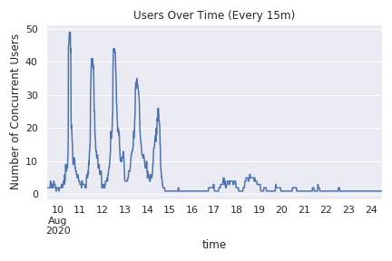
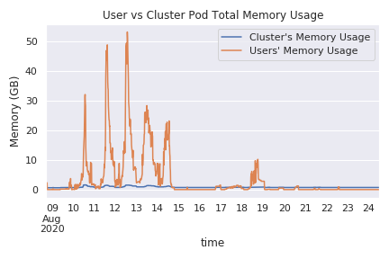

# Notes on JupyterHub Infrastructure for OceanHackWeek 2020

Relevant Links:
- [JupyterHub Configuration](https://github.com/oceanhackweek/jupyterhub)
- [Infrastructure Configuration](https://github.com/oceanhackweek/ohw-terraform-deploy/tree/main)
- [Computational Environment](https://github.com/oceanhackweek/jupyter-image)

### Versions:
- Terraform version: [12.6](https://github.com/oceanhackweek/ohw-terraform-deploy/blob/main/aws/main.tf#L2)
- Helm Version: 3. Minor version is not recalled or recorded.
- JupyterHub Helm chart version: [v0.9.0-beta.3.n030.h796379e](https://github.com/oceanhackweek/jupyterhub/blob/staging/hub/requirements.yaml)
- Prometheus Helm chart version: [11.2.1](https://github.com/oceanhackweek/ohw-terraform-deploy/blob/main/aws/monitoring.tf#L25)
- Grafana Helm chart version: [5.0.24](https://github.com/oceanhackweek/ohw-terraform-deploy/blob/main/aws/monitoring.tf#L44)
- Cluster-autoscaler Helm chart version: [unspecified](https://github.com/oceanhackweek/ohw-terraform-deploy/blob/main/aws/autoscaler.tf#L74)
- EFS-Provisioner Helm chart version: [0.11.0](https://github.com/oceanhackweek/ohw-terraform-deploy/blob/main/aws/efs.tf#L64)
- AWS Node Termination Helm chart version: [unspecified](https://github.com/oceanhackweek/ohw-terraform-deploy/blob/main/aws/aws-node-termination-handler.tf)

### Stand up JupyterHub, Notes

Make new `terraform-bot` as `ohw-terraform-bot`. Command to use
default profile is

```
terraform apply -var-file=../../ohw.tfvars -var 'profile=default'
```

Make access keys for `ohw-terraform-bot`, test with

```
aws sts get-caller-identity --profile ohw-terraform-bot
```

Couldn't figure out permissions for version control, added
permissions for S3 encryption.

VPC tags references EKS cluster id and created a cycle bc the vpc
should be created first. Referenced cluster_id in the tags via the
same string interpolation used to create the eks cluster

```
terraform apply -var-file=../../ohw.tfvars -var-file=../../supprt/secrets.tfvars
```

Login to the bastion instance, run

```bash
cd /mnt/efs
sudo mkdir ocean.hackweek.io
cd ocean.hackweek.io
sudo mkdir tutorial-data
sudo mkdir shared
```

Trying GitHub auth for Grafana. Works to get auth for anyone in the
GitHub org. Can't get teams to be responsive yet.

### Secondary S3 Bucket

Separate folder for terraform state since it needs a different aws
provider w/ different region.

Create bucket and equivalent access policy (like the first bucket).
Need to attach this new policy to the role created in
`s3-data-bucket.tf`, so this would generally be run after the main
bunch of Terraform `apply`ing.

### Costs

Large charge on Aug 12th, EC2-Other. API Operation for this is
listed as NatGateway. Data transfer from somewhere?

Interesting tiny discrepancy in cost explorer: total costs and EC2
Other costs are 8 cents lower when filtering by
"Project=ohw-project" after having filtered for
"Owner=ohw-terraform-bot"

### Closing Thoughts

Didn't have others hooked into infrastructure at all. No testing if
they could actually alter it. Should have a process to set this up
at the beginning.

Grafana with GitHub login was configured and worked great! Docs for
that are here; https://grafana.com/docs/grafana/latest/auth/github/
Others used Grafana with GitHub login just fine, didn't mind being
Viewers and not Editors.

I have been pushing directly to staging, which is easier for me but
probably unprofessional.

### OHW Closing Thoughts Call: Infrastructure

- Should have a deadline for the packages that will be used in the
hub.
- Consider higher memory nodes (so participants have more memory)
- Should have Grafana data saving as part of the shutdown process.

### Tear Down

Shutdown commands, as I ran them, plus notes:

```bash
helm delete ohw-hub-staging -n ohw-hub-staging
helm delete ohw-hub-prod -n ohw-hub-prod
cd cloud-infrastructure/aws/secondary-bucket
terraform destroy --var-file ../../../secondary-s3-bucket.tfvars
yes
[1][2]
cd ..
terraform destroy --var-file ../../ohw.tfvars
yes
[3]
cd ../s3-backend
terraform destroy --var-file ../../ohw.tfvars
[4]
cd ../aws-creds
terraform destroy
[5]
```

[1] I can't delete the policy version, needed to add that to the IAM user.
  - Can't add that, delete the policy manually.

[2] Bucket isn't empty, delete manually.

[3] Bucket isn't empty, delete manually, then re-run the command.

[4] Error deleting an object version, Access Denied, delete manually.

[5] Need to delete access keys manually, then re-run command.

Updated github with config for future reference.

Removed DNS records

### Time Spent on this

- (0.5 + 3 hours) infrastructure standup
- (3 hours) JupyterHub standup
- (2 hours) Image setup
- (4 hours) maintenance
- (0.5 hours) secondary S3 bucket
- (2 hours) closing thoughts call
- (1 hour) jupyterhub teardown

### Usage Plots




